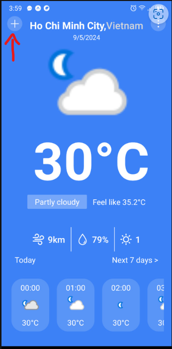
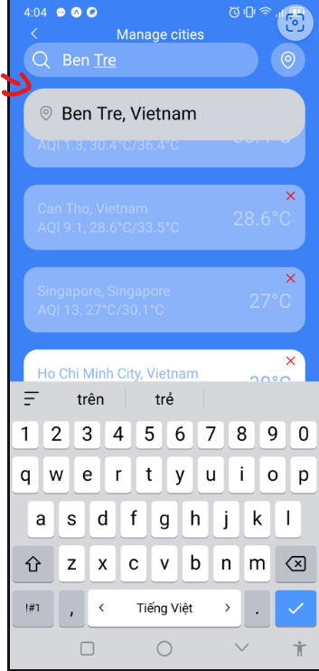
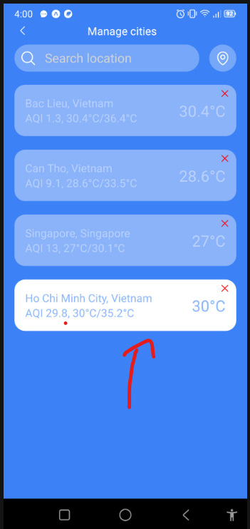

Feature:
-Search (debounce),list add, remove location, get current location weather.

-Config Axios Interceptor

-Call Api from WeatherApi

-RTK config(not done)

This project build with Expo and test on android device, flowing these step to run:

1: download Expo app on GG Play or App Store,
2: download or clone source code from github, run "npm i", after that run "npx expo start"
3: open the Expo app on your mobile device, scan the QR code in the terminal

4: in home screen click Plus Icon to add the location you want to know the weather, default is the current weather of Ho Chi Minh City

click "search location bar", input and wait to loading the location and 

click on the location to add into the list

note that: the white background is the current weather in the Home Screen

5: click the item on the list to see the forecast in home screen

7: click "Next 7 day" to see forecast in next 7 day, the same layout with Search Screen
